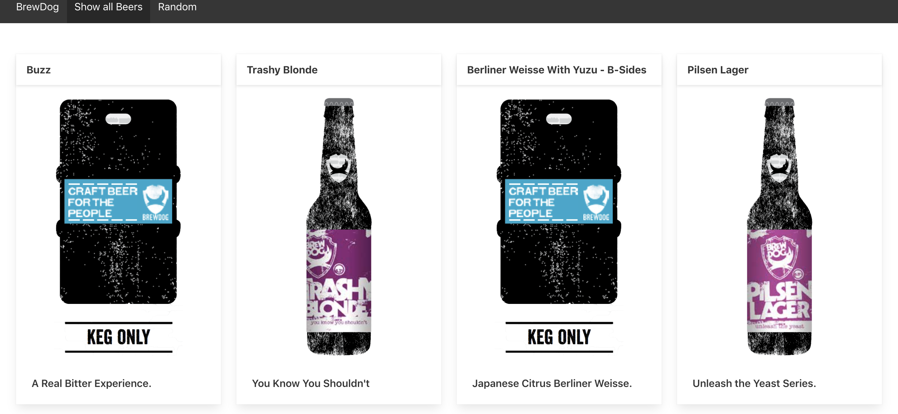
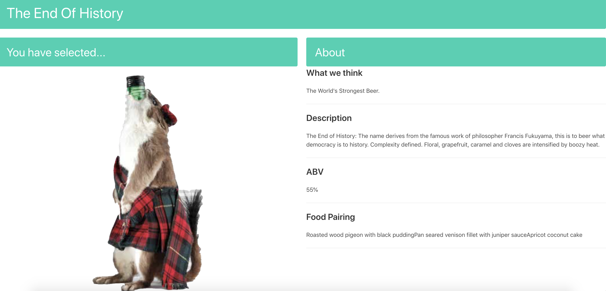

## BrewDog Beers Project

A small fun project where I created a single page React application to consume a BrewDog Punk JSON API. This was built in 24-hours. 

You can find the BrewDog Punk Base URL: https://api.punkapi.com/v2/beers/

## Website Architecture: 
### See all beers

### See a single beer

### Pick a random beer

